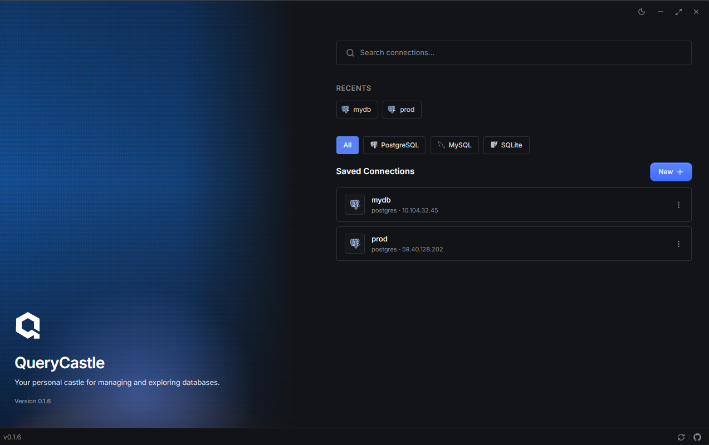
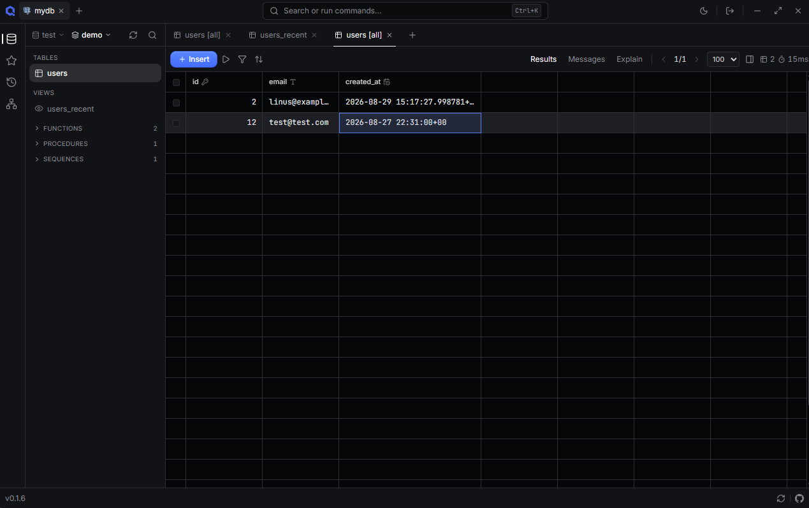

# QueryCastle

A desktop SQL client for PostgreSQL, MySQL, and SQLite.





Open a connection, browse the schema, run queries, and edit rows in the grid.

- Saved connections, or paste a connection string
- Schema explorer for tables, views, functions, and sequences
- SQL editor with autocomplete and formatting (`Ctrl+Enter` to run)
- Results grid you can edit in place
- Query tabs, saved queries, and per-connection history

Windows is the supported desktop build right now.

## Run locally

You need Node.js, Rust, and the [Tauri prerequisites](https://v2.tauri.app/start/prerequisites/).

```bash
npm install
npm run dev
```

To build an installer:

```bash
npx tauri build
```

## License

MIT. See [LICENSE](LICENSE).
